R, matrix, image, etc. 
========================================================

Matrix and image
========================================================
In R, matrices are ordered row-wise: 


```r
(m <- matrix(1:12, nrow = 3, ncol = 4))
```

```
##      [,1] [,2] [,3] [,4]
## [1,]    1    4    7   10
## [2,]    2    5    8   11
## [3,]    3    6    9   12
```


The *image()* function presents this as the transpose of what we see printed. 


```r
m[] <- 0
m[2, 1] <- -10
m[3, 2] <- 30
m
```

```
##      [,1] [,2] [,3] [,4]
## [1,]    0    0    0    0
## [2,]  -10    0    0    0
## [3,]    0   30    0    0
```

```r
t(m[, ncol(m):1])
```

```
##      [,1] [,2] [,3]
## [1,]    0    0    0
## [2,]    0    0    0
## [3,]    0    0   30
## [4,]    0  -10    0
```


```r
help(image)
```


> ... Notice that image interprets the z matrix as a table of f(x[i], y[j]) values, 
> so that the x axis corresponds to row number and the y axis to column number, 
> with column 1 at the bottom, i.e. a __90 degree counter-clockwise rotation__ of 
> the conventional printed layout of a matrix.
> ...


```r
image(m)
```

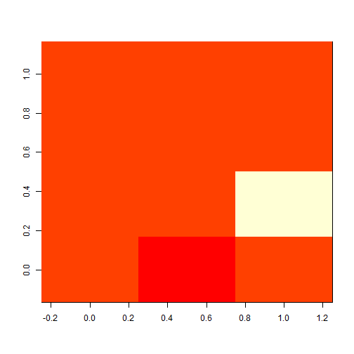 


Data placement with image()
===========================================
This is fairly obvious, each cell is painted as a discrete block with cell centres evenly spaced between 0 and 1. 

```r
m <- matrix(1:12, 3)
image(m)
```

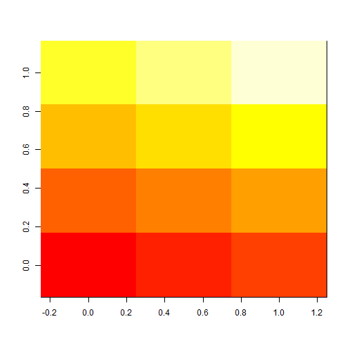 


We didn't give it any coordinates to position the image, so it made some up. 


```r
image(m, main = "input coordinates are cell centres")
xx <- seq.int(0, 1, length.out = nrow(m))
yy <- seq.int(0, 1, length.out = ncol(m))
abline(h = yy, v = xx, lty = 2)
```

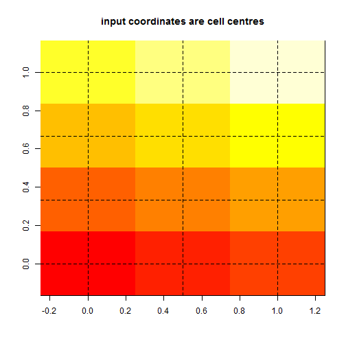 


This lends itself to a convenient data structure. 


```r
dat <- list(x = xx, y = yy, z = m)
image(dat)
text(expand.grid(xx, yy), lab = as.vector(m))
```

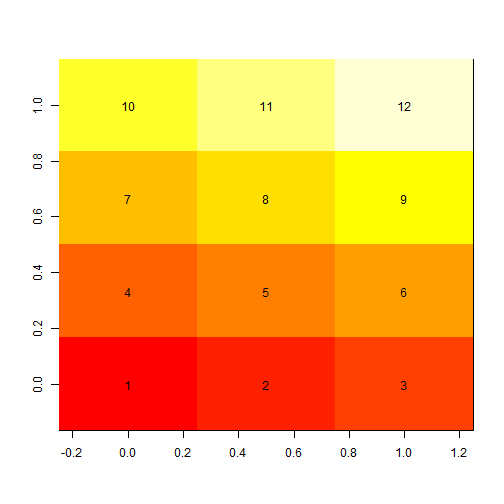 

```r

## points(expand.grid(xx, yy))
```


The function *image()* has some hidden tricks. 


```r
xcorner <- seq.int(0, 1, length.out = nrow(m) + 1L)
ycorner <- seq.int(0, 1, length.out = ncol(m) + 1L)
print(xcorner)
```

```
## [1] 0.0000 0.3333 0.6667 1.0000
```

```r
print(ycorner)
```

```
## [1] 0.00 0.25 0.50 0.75 1.00
```

```r
image(xcorner, ycorner, m, main = "input coordinates are cell corners")
abline(h = ycorner, v = xcorner)
```

 


We can even use non-regular coordinates. 


```r
ycorner <- 1.5^seq_along(ycorner)
image(xcorner, ycorner, m)
abline(h = ycorner, v = xcorner)
```

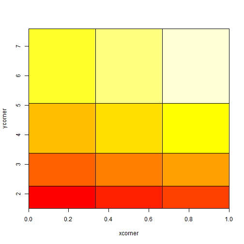 


Under the hood
=====================================================


```r
print(image.default)
```


> ...
> ...
> .External.graphics(C_image, x, y, zi, col)

![alt text][slowImage]

This is  like looping with *rect()*


```r
op <- par(mfrow = c(1, 2))
## life is hard
cols <- topo.colors(25)
scale <- round((m - min(m))/diff(range(m)) * (length(cols) - 1) + 1)
plot(NA, type = "n", xlim = range(xcorner), ylim = range(ycorner), asp = 1)
for (i in seq_along(xcorner[-1L])) {
    for (j in seq_along(ycorner[-1L])) {
        rect(xleft = xcorner[i], ybottom = ycorner[j], xright = xcorner[i + 
            1L], ytop = ycorner[j + 1L], col = cols[scale[i, j]], angle = 45 * 
            (i + j)%%2, density = 20, lwd = 2)
    }
    
}

## life is good
image(list(x = xcorner, y = ycorner, z = m), col = topo.colors(25), asp = 1)
```

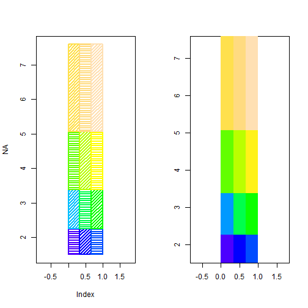 

```r

par(op)
```


"Raster graphics" (not the *raster* package)
===========================================================
Relatively recently native image-graphics support was added to R. 

Old style

```r
m <- matrix(1:12, nrow = 3)
xcorner <- seq.int(0, 1, length.out = nrow(m) + 1L)
ycorner <- seq.int(0, 1, length.out = ncol(m) + 1L)
image(xcorner, ycorner, m, col = topo.colors(25))
```

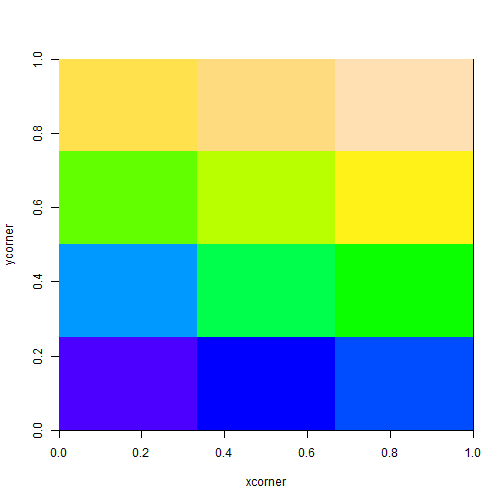 

New style

```r
plot(range(xcorner), range(ycorner), type = "n")
rim <- (m - min(m))/diff(range(m))
## cripes
rim <- t(rim[, ncol(rim):1])
cols <- topo.colors(25)
## now our image is the actual colours
rim[] <- cols[rim * (length(cols) - 1) + 1]
rasterImage(rim, min(xcorner), min(ycorner), max(xcorner), max(ycorner), interpolate = FALSE)
```

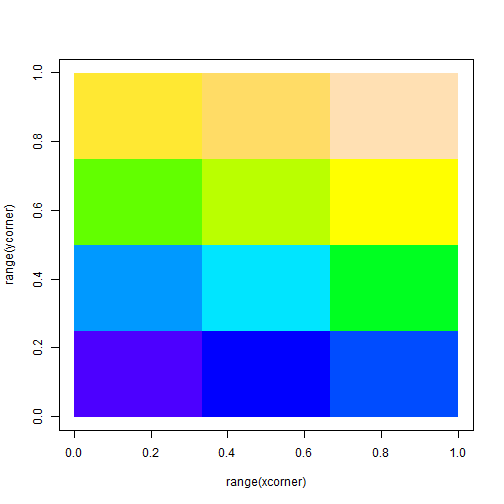 

Isn't this all the same?


```r
plot(range(xcorner), range(ycorner), type = "n", main = "with interpolation")
rasterImage(rim, min(xcorner), min(ycorner), max(xcorner), max(ycorner), interpolate = TRUE)
```

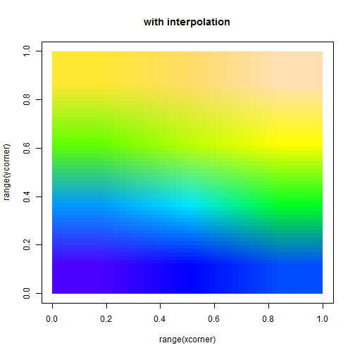 

```r
plot(range(xcorner) + c(-0.5, 0), range(ycorner) + c(0, 0.5), type = "n", main = "with interpolation, and rotation")
rasterImage(rim, min(xcorner), min(ycorner), max(xcorner), max(ycorner), interpolate = TRUE, 
    angle = 33)
```

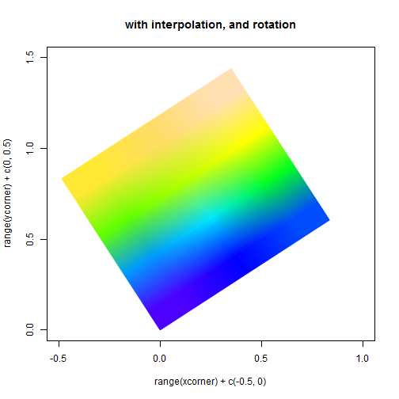 


And so this is much faster for large images

But doesn't work for the old irregular set up


```r
ycorner <- 1.5^seq_along(ycorner)
image(xcorner, ycorner, m, useRaster = TRUE)
```

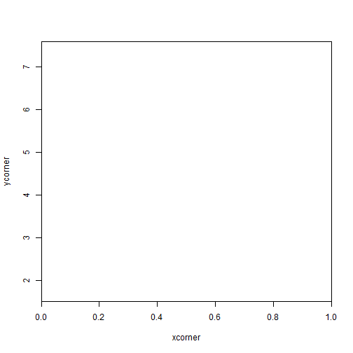 

```
## Error in image.default(xcorner, ycorner, m, useRaster = TRUE) : 
##   'useRaster = TRUE' can only be used with a regular grid
```


raster is very flexible
===============================================================

Build raster objects from raw R objects. 


```r
xx <- seq.int(0, 1, length.out = nrow(m))
yy <- seq.int(0, 1, length.out = ncol(m))
m <- matrix(1:12, 3)
im <- list(x = xx, y = yy, z = m)
library(raster)
```

```
## Loading required package: sp
```

```r
raster(im)
```

```
## class       : RasterLayer 
## dimensions  : 4, 3, 12  (nrow, ncol, ncell)
## resolution  : 0.5, 0.3333  (x, y)
## extent      : -0.25, 1.25, -0.1667, 1.167  (xmin, xmax, ymin, ymax)
## coord. ref. : +proj=longlat +datum=WGS84 
## data source : in memory
## names       : layer 
## values      : 1, 12  (min, max)
```

```r

(r1 <- raster(m, xmn = min(xx), xmx = max(xx), ymn = min(yy), ymx = max(yy)))
```

```
## class       : RasterLayer 
## dimensions  : 3, 4, 12  (nrow, ncol, ncell)
## resolution  : 0.25, 0.3333  (x, y)
## extent      : 0, 1, 0, 1  (xmin, xmax, ymin, ymax)
## coord. ref. : NA 
## data source : in memory
## names       : layer 
## values      : 1, 12  (min, max)
```

Extract values


```r
values(r1)
```

```
##  [1]  1  4  7 10  2  5  8 11  3  6  9 12
```

```r

values(r1, format = "matrix")
```

```
##      [,1] [,2] [,3] [,4]
## [1,]    1    4    7   10
## [2,]    2    5    8   11
## [3,]    3    6    9   12
```


Build raster objects from files


```r

raster("\\\\aad.gov.au\\files\\AADC\\Scientific_Data\\Data\\gridded\\data\\sst\\oiv2\\sst.mnmean.nc", 
    band = 125)
```

```
## Loading required package: ncdf
```

```
## class       : RasterLayer 
## band        : 125  (of  387  bands)
## dimensions  : 180, 360, 64800  (nrow, ncol, ncell)
## resolution  : 1, 1  (x, y)
## extent      : 0, 360, -90, 90  (xmin, xmax, ymin, ymax)
## coord. ref. : +proj=longlat +datum=WGS84 
## data source : \\aad.gov.au\files\AADC\Scientific_Data\Data\gridded\data\sst\oiv2\sst.mnmean.nc 
## names       : Monthly.Mean.of.Sea.Surface.Temperature 
## z-value     : 1992-04-01 
## zvar        : sst
```

```r


raster("\\\\aad.gov.au\\files\\AADC\\Scientific_Data\\Data\\gridded\\data\\seaice\\smmr_ssmi_nasateam\\daily\\2014\\nt_20140312_f17_nrt_s.bin")
```

```
## rgdal: version: 0.8-16, (SVN revision 498)
## Geospatial Data Abstraction Library extensions to R successfully loaded
## Loaded GDAL runtime: GDAL 1.10.1, released 2013/08/26
## Path to GDAL shared files: C:/inst/R/R/library/rgdal/gdal
## GDAL does not use iconv for recoding strings.
## Loaded PROJ.4 runtime: Rel. 4.8.0, 6 March 2012, [PJ_VERSION: 480]
## Path to PROJ.4 shared files: C:/inst/R/R/library/rgdal/proj
```

```
## class       : RasterLayer 
## dimensions  : 332, 316, 104912  (nrow, ncol, ncell)
## resolution  : 25000, 25000  (x, y)
## extent      : -3950000, 3950000, -3950000, 4350000  (xmin, xmax, ymin, ymax)
## coord. ref. : +proj=stere +lat_0=-90 +lat_ts=-71 +lon_0=0 +k=1 +x_0=0 +y_0=0 +datum=WGS84 +units=m +no_defs +ellps=WGS84 +towgs84=0,0,0 
## data source : in memory
## names       : layer 
## values      : 0.4, 100  (min, max)
## time        : 2014-03-12
```


For colour images (RGB) we need to deal with "3-layers". 


```r
antarc <- brick("\\\\aad.gov.au\\files\\Transfer\\Michael Sumner\\ant_and_sthn_ocean_13989\\ant_and_sthn_ocean_13989.tif")
plotRGB(antarc)


grat <- expand.grid(lon = seq(-180, 170, by = 10), lat = seq(-85, -45, by = 5))
library(rgdal)
gratpts <- project(as.matrix(grat), projection(antarc))
points(gratpts, pch = 3)
```

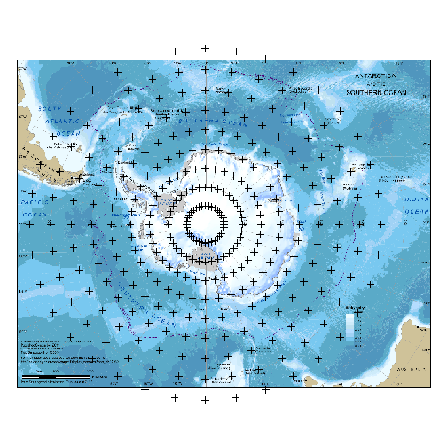 


To and from other package classes. 


```r
library(spatstat)
```

```
## 
## spatstat 1.36-0       (nickname: 'Intense Scrutiny') 
## For an introduction to spatstat, type 'beginner'
## 
## Attaching package: 'spatstat'
## 
## The following objects are masked from 'package:raster':
## 
##     rotate, shift
```

```r
m <- matrix(1:12, 3)
xx <- seq.int(0, 1, length.out = nrow(m))
yy <- seq.int(0, 1, length.out = ncol(m))

image(list(x = xx, y = yy, z = m))

text(expand.grid(xx, yy), lab = as.vector(m))
```

 

```r

## transpose
im.obj <- im(t(m), xx, yy)
```


```r
help(im.object)
```


>   Note carefully that the entry 'v[i,j]' gives the pixel value at
>     the location '(xcol[j],yrow[i]'.  That is, the *row* index of the
>     matrix 'v' corresponds to increasing *y* coordinate, while the
>     column index of 'mat' corresponds to increasing *x* coordinate.
>     Thus 'yrow' has one entry for each row of 'v' and 'xcol' has one
>     entry for each column of 'v'.  Under the usual convention in R, a
>     correct display of the image would be obtained by transposing the
>     matrix, e.g.  'image.default(xcol, yrow, t(v))', if you wanted to
>    do it by hand.


```r
## raster knows about im already, but there's no im from raster

raster(im)
```

```
## class       : RasterLayer 
## dimensions  : 4, 3, 12  (nrow, ncol, ncell)
## resolution  : 0.5, 0.3333  (x, y)
## extent      : -0.25, 1.25, -0.1667, 1.167  (xmin, xmax, ymin, ymax)
## coord. ref. : +proj=longlat +datum=WGS84 +ellps=WGS84 +towgs84=0,0,0 
## data source : in memory
## names       : layer 
## values      : 1, 12  (min, max)
```

```r

as.im.RasterLayer <- function(x, ...) {
    mx <- getValues(x, format = "matrix")
    im(mx[nrow(mx):1, ], xFromCol(x), yFromRow(x))
}

## round trip
as.im(raster(im))
```

```
## integer-valued pixel image
## 4 x 3 pixel array (ny, nx)
## enclosing rectangle: [-0.25, 1.25] x [-0.16667, 1.1667] units
```


[slowImage]: figure/slowImage.png "Slow image"
